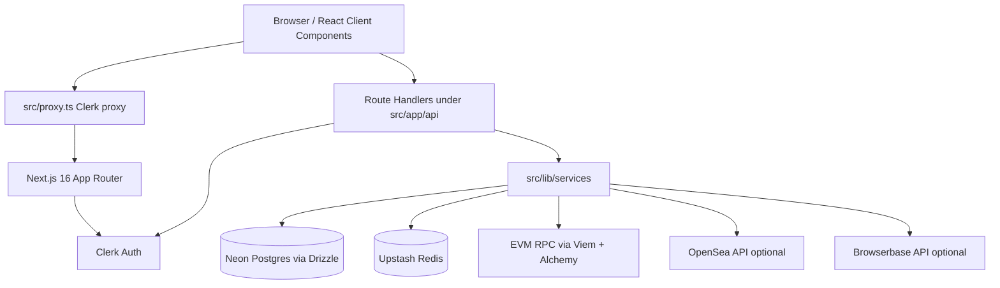
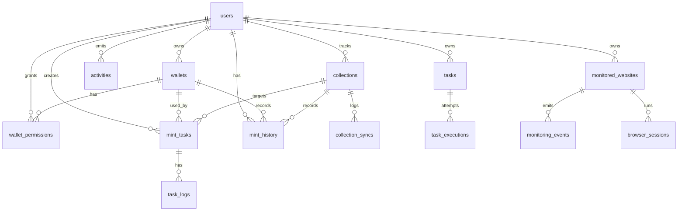

# AutoMint AI Handoff and Architecture Review

Generated from the working tree on 2026-06-20. Scope: authored repository files, configuration, local documentation, schema, source, and existing project reports. Generated/vendor/build directories (`node_modules`, `.next`, `.git`) are identified but not line-by-line reviewed as application source.

## 1. Executive Summary

AutoMint is a Next.js 16 App Router application for NFT mint intelligence and controlled mint execution. The product helps authenticated operators analyze launchpad or explorer URLs, track wallets and collections, create mint tasks, simulate or execute mints, and monitor operational activity.

Business purpose: reduce the risk and latency of NFT mint decisions by combining contract metadata, mint-state detection, wallet readiness, queueing, and a dark operational dashboard. The most valuable code lives in the analyzer flow, wallet/collection management, mint task execution, and blockchain service layer: [src/app/api/analyzer/route.ts](../src/app/api/analyzer/route.ts:14), [src/lib/services/mint.service.ts](../src/lib/services/mint.service.ts:41), [src/lib/blockchain/mint.ts](../src/lib/blockchain/mint.ts:193), and [src/lib/resolve-mint-intent.ts](../src/lib/resolve-mint-intent.ts:145).

Primary users: NFT mint operators, collectors, or internal admins using Clerk-authenticated accounts. Admin-only access currently exists only for system health: [src/app/api/admin/system/health/route.ts](../src/app/api/admin/system/health/route.ts:13).

Core workflows:

| Workflow | Current state | Entry points |
| --- | --- | --- |
| Public intake | User pastes a URL/address on `/`, then navigates to analyzer with `?input=` | [src/app/page.tsx](../src/app/page.tsx:1), [src/app/(authenticated)/analyzer/page.tsx](../src/app/(authenticated)/analyzer/page.tsx:1) |
| Analyze mint | Resolve URL/address, fetch metadata, mint state, requirements, ABI guess, derive scores in UI | [src/app/api/analyzer/route.ts](../src/app/api/analyzer/route.ts:14), [src/app/(authenticated)/analyzer/analyzer-client.tsx](../src/app/(authenticated)/analyzer/analyzer-client.tsx:120) |
| Manage wallets | Add/list/delete EVM wallet addresses, refresh balances | [src/app/api/wallets/route.ts](../src/app/api/wallets/route.ts:7), [src/app/(authenticated)/wallets/wallets-client.tsx](../src/app/(authenticated)/wallets/wallets-client.tsx:53) |
| Manage collections | Add/list/delete contracts, best-effort metadata sync | [src/app/api/collections/route.ts](../src/app/api/collections/route.ts:7), [src/lib/services/collection.service.ts](../src/lib/services/collection.service.ts:15) |
| Mint tasks | Create tasks from saved wallet/collection, start/cancel/delete tasks, simulate by default | [src/app/api/mints/route.ts](../src/app/api/mints/route.ts:7), [src/lib/services/mint.service.ts](../src/lib/services/mint.service.ts:41) |
| Search and notifications | Client app shell calls user-scoped search and activities endpoints | [src/components/app-shell.tsx](../src/components/app-shell.tsx:113), [src/app/api/search/route.ts](../src/app/api/search/route.ts:8), [src/app/api/activities/route.ts](../src/app/api/activities/route.ts:7) |
| Website monitoring | API/schema/service exist, but no scheduler/UI consumes the monitor service yet | [src/app/api/monitoring/websites/route.ts](../src/app/api/monitoring/websites/route.ts:8), [src/lib/services/website-monitor.service.ts](../src/lib/services/website-monitor.service.ts:134) |

Key features:

- Clerk-authenticated app shell and protected page group through Next 16 `proxy.ts`: [src/proxy.ts](../src/proxy.ts:14).
- Neon Postgres through Drizzle ORM with lazy DB initialization: [src/lib/db/index.ts](../src/lib/db/index.ts:9).
- EVM chain support for Ethereum, Base, and Polygon: [src/lib/blockchain/chains.ts](../src/lib/blockchain/chains.ts:3).
- Analyzer uses OpenSea/block explorer parsing and on-chain calls: [src/lib/resolve-mint-intent.ts](../src/lib/resolve-mint-intent.ts:145), [src/lib/services/mint-state.service.ts](../src/lib/services/mint-state.service.ts:100).
- Mint execution defaults to simulation unless `MINT_MODE=live` or production default live: [src/lib/blockchain/mint.ts](../src/lib/blockchain/mint.ts:10).

## 2. System Architecture



Frontend/backend structure:

- Frontend pages live in [src/app](../src/app), using Server Components by default and client islands for interactive surfaces.
- Authenticated pages are grouped under [src/app/(authenticated)](../src/app/(authenticated)); the route group does not affect URLs.
- Backend-for-frontend endpoints live as App Router route handlers under [src/app/api](../src/app/api), consistent with the local Next 16 docs in `node_modules/next/dist/docs/01-app/01-getting-started/15-route-handlers.md`.
- `src/proxy.ts` uses the Next 16 proxy convention, replacing legacy middleware terminology per `node_modules/next/dist/docs/01-app/01-getting-started/16-proxy.md`.

Service boundaries:

| Boundary | Responsibility |
| --- | --- |
| Route handlers | Auth checks, request parsing, HTTP status mapping |
| `lib/services` | Business workflows and DB mutations |
| `lib/blockchain` | Viem clients, contract reads, gas, transaction/mint execution |
| `lib/auth` | Clerk-to-internal-user synchronization and authorization helpers |
| `lib/db` | Lazy Neon/Drizzle singleton |
| `lib/redis` | Optional cache, health, and lock helpers |
| `components/ui` | Lightweight local UI primitives |

Request lifecycle:

1. Request enters Next `proxy.ts`; protected page routes call `auth.protect()` for pages listed in [src/proxy.ts](../src/proxy.ts:3).
2. Root layout wraps all routes with Clerk and Geist fonts: [src/app/layout.tsx](../src/app/layout.tsx:26).
3. Authenticated layout checks `auth()`, redirects anonymous users, syncs Clerk user into `users`, and renders `AppShell`: [src/app/(authenticated)/layout.tsx](../src/app/(authenticated)/layout.tsx:7).
4. Client components call `apiRequest`, which JSON-serializes object bodies and throws `ApiClientError` on non-2xx responses: [src/lib/api/client.ts](../src/lib/api/client.ts:9).
5. API routes call `requireApiSession`, `requireApiUser`, or `requireAdminApiSession`: [src/lib/auth/require-auth.ts](../src/lib/auth/require-auth.ts:24).
6. Services use Drizzle through `getDb()` and call chain/Redis/integration helpers as needed.

Event flow:

- User actions create activities through `logActivity` in wallet/collection/mint services: [src/lib/monitoring/index.ts](../src/lib/monitoring/index.ts:21).
- Notifications fetch the latest `activities` rows: [src/components/app-shell.tsx](../src/components/app-shell.tsx:142), [src/app/api/activities/route.ts](../src/app/api/activities/route.ts:7).
- Monitoring events are separate from activities and are produced by `checkWebsite`, but no cron route currently invokes it: [src/lib/services/website-monitor.service.ts](../src/lib/services/website-monitor.service.ts:134).

## 3. Technology Stack

| Category | Stack |
| --- | --- |
| Languages | TypeScript, TSX, CSS |
| Framework | Next.js `16.2.9`, App Router, React `19.2.7` |
| Styling | Tailwind CSS v4 through `@tailwindcss/postcss`, local primitives |
| Auth | Clerk `@clerk/nextjs` |
| Database | Neon Postgres, Drizzle ORM, Drizzle Kit |
| Blockchain | Viem, Alchemy RPC URLs |
| Cache/locks | Upstash Redis |
| Automation integration | Browserbase REST stub/client |
| Animation/icons | Framer Motion, Lucide React |
| Package manager | npm with `package-lock.json` |
| Runtime | Node `>=20.9.0` from [package.json](../package.json:5) |
| Deployment | Vercel config, build runs `npm run db:push && next build`: [vercel.json](../vercel.json:3) |

Important scripts are in [package.json](../package.json:8): `dev`, `build`, `start`, `lint`, `typecheck`, `audit:deps`, `db:generate`, `db:push`, and `db:studio`.

## 4. Repository Structure

```
/
  purpose: Next.js app root, config, package metadata, deployment settings.
  important files: package.json, next.config.ts, tsconfig.json, drizzle.config.ts, vercel.json, AGENTS.md, .env.example.

/.clerk
  purpose: local Clerk keyless development artifact.
  important files: .tmp/keyless.json contains local test keys; .tmp/README.md says do not commit.
  note: ignored by .gitignore and not tracked in current git state, but still secret-like local material.

/.git
  purpose: repository metadata.
  important files: not application source.

/.next
  purpose: generated Next build/dev output.
  important files: not application source; ignored/generated.

/docs
  purpose: project audit reports and this handoff.
  important files: frontend-audit.md, dependency-modernization-report.md, integration-wiring-report.md, ai-handoff.md.

/node_modules
  purpose: installed dependencies and local Next docs required by AGENTS.md.
  important files: node_modules/next/dist/docs for local Next 16 conventions.

/prisma
  purpose: empty legacy/placeholder directory.
  important files: none.

/public
  purpose: static assets served by Next.
  important files: file.svg, globe.svg, next.svg, vercel.svg, window.svg.
  note: these are tracked scaffold assets and currently unused by `src`.

/src
  purpose: application source.
  important files: proxy.ts, app/**, components/**, drizzle/**, lib/**.

/src/app
  purpose: App Router routes, layouts, pages, loading/not-found UI, route handlers.
  important files: layout.tsx, page.tsx, globals.css, api/**, (authenticated)/**, sign-in/**, sign-up/**.

/src/app/(authenticated)
  purpose: authenticated route group for dashboard/product UI.
  important files: layout.tsx, template.tsx, dashboard/page.tsx, analyzer, wallets, collections, mints.

/src/app/api
  purpose: Backend-for-frontend HTTP route handlers.
  important files: analyzer, wallets, collections, mints, blockchain, monitoring, search, history, activities, admin/system/health.

/src/components
  purpose: shared client shell, auth button, route transition, UI primitives.
  important files: app-shell.tsx, route-transition.tsx, auth/automint-user-button.tsx, ui/*.

/src/drizzle
  purpose: Drizzle database schema and migrations location.
  important files: schema/index.ts, schema/tasks.ts, schema/monitoring.ts.
  note: migrations directory exists but is empty.

/src/lib
  purpose: server/business libraries: auth, API helpers, blockchain, Browserbase, config, DB, monitoring, Redis, security, services.
  important files: db/index.ts, auth/require-auth.ts, services/mint.service.ts, blockchain/mint.ts.
```

## 5. Entry Points

Application startup:

1. `next dev`, `next build`, or `next start` from [package.json](../package.json:8).
2. Next loads [next.config.ts](../next.config.ts:1), TypeScript config, and App Router files.
3. Requests pass through [src/proxy.ts](../src/proxy.ts:14), which protects authenticated page routes and matches API routes too.
4. Root layout initializes fonts and Clerk provider: [src/app/layout.tsx](../src/app/layout.tsx:26).
5. Public `/` renders the marketing/intake homepage: [src/app/page.tsx](../src/app/page.tsx:1).
6. Authenticated pages render through [src/app/(authenticated)/layout.tsx](../src/app/(authenticated)/layout.tsx:7), which syncs users and mounts [src/components/app-shell.tsx](../src/components/app-shell.tsx:102).

Initialization flow:

- DB and Redis are lazy singletons to avoid Next build-time env crashes: [src/lib/db/index.ts](../src/lib/db/index.ts:9), [src/lib/redis/index.ts](../src/lib/redis/index.ts:8). This matches the Next 16 skill guidance.
- Auth user synchronization happens opportunistically in layout and API calls: [src/lib/auth/sync-user.ts](../src/lib/auth/sync-user.ts:6), [src/lib/auth/require-auth.ts](../src/lib/auth/require-auth.ts:37).
- There is no dependency injection framework; modules import service helpers directly.

Bootstrapping logic:

- `npm install` installs packages.
- `npm run db:push` pushes schema directly from Drizzle schema.
- Vercel build currently runs schema push during build, which is convenient but risky for production migrations: [vercel.json](../vercel.json:3).

## 6. Module-by-Module Analysis

### App Shell and Navigation

Purpose: authenticated product chrome, navigation, search, notifications, static top metrics.

Responsibilities: sidebar/mobile drawer, global search, activities popover, user menu, page container.

Inputs: current pathname, search string, notification open state.

Outputs: navigation UI, calls to `/api/search` and `/api/activities`.

Dependencies: Clerk user button, `apiRequest`, Lucide icons.

Used by: authenticated layout.

Important functions: `Navigation`, `openNotifications`, search `useEffect`: [src/components/app-shell.tsx](../src/components/app-shell.tsx:113).

Potential risks: global header metrics are hardcoded; notifications are fetched once and not refreshed live.

### Authentication Module

Purpose: unify Clerk sessions with internal `users.id`.

Responsibilities: page protection, API session checks, user sync, admin allowlist/role checks.

Inputs: Clerk `auth()` and `currentUser()`, `ADMIN_CLERK_USER_IDS`, session claims.

Outputs: internal user UUID or HTTP errors.

Dependencies: Clerk server SDK, Drizzle users table.

Used by: layouts and nearly every API route.

Important functions: `requireApiSession`, `requireApiUser`, `requireAdminApiSession`, `syncUser`.

Potential risks: API routes requiring only `requireApiSession` do not sync internal users and are less scoped than user-owned endpoints; admin roles depend on claims/allowlist only.

### Database Module and Schema

Purpose: Postgres persistence for users, wallets, collections, mint tasks/history, activities, generic tasks, monitoring.

Responsibilities: schema declaration, relations, lazy DB singleton.

Inputs: `DATABASE_URL`.

Outputs: Drizzle query client and table metadata.

Dependencies: Neon serverless, Drizzle.

Used by: all services and DB-backed routes.

Important files: [src/drizzle/schema/index.ts](../src/drizzle/schema/index.ts:24), [src/drizzle/schema/tasks.ts](../src/drizzle/schema/tasks.ts:28), [src/drizzle/schema/monitoring.ts](../src/drizzle/schema/monitoring.ts:43).

Potential risks: no generated migrations committed; production build uses `db:push`; no unique DB constraints for wallet/user/chain or collection/user/chain despite application-level duplicate checks.

### Wallet Service

Purpose: user-owned wallet CRUD and optional imported private-key support.

Responsibilities: validate EVM address, supported chains, duplicate check, create wallet permissions, activity logging, private-key encryption/decryption helpers.

Inputs: user UUID, wallet address, chain, optional private key.

Outputs: wallet rows, balance results, decrypted private key for fast mint.

Dependencies: Drizzle, encryption, blockchain wallet balance, activity logging.

Used by: wallet API, mint fast path.

Important functions: `createWallet`, `importWallet`, `getDecryptedPrivateKey`, `removeWallet`: [src/lib/services/wallet.service.ts](../src/lib/services/wallet.service.ts:25).

Potential risks: `importWallet` is not exposed by current API/UI but stores encrypted private keys; it does not duplicate-check or supported-chain validate as strictly as `createWallet`.

### Collection Service

Purpose: user-owned collection watchlist CRUD with best-effort metadata sync.

Responsibilities: validate contract address/chain, duplicate check, insert row, fetch metadata, update row, log activity.

Inputs: name, contract address, chain.

Outputs: collection row.

Dependencies: Drizzle, blockchain collection metadata, activity logging.

Used by: collection API, mint task creation.

Important functions: `addCollection`, `removeCollection`: [src/lib/services/collection.service.ts](../src/lib/services/collection.service.ts:15).

Potential risks: metadata sync failure is swallowed; collection deletion has no activity log.

### Analyzer

Purpose: flagship workflow that turns URL/address input into collection metadata, mint state, requirements, inferred mint function, and UI scores.

Responsibilities: normalize input, resolve contract intent, call chain metadata/mint state/requirements/ABI discovery in parallel, return result.

Inputs: `{ input }` JSON body.

Outputs: intent, metadata, mint state, requirements, mint function, timestamp.

Dependencies: Clerk session, resolver, blockchain services.

Used by: analyzer client page and homepage link.

Important functions: route `POST`, `resolveMintIntent`, `getMintState`, `fetchMintRequirements`, `discoverMintFunction`.

Potential risks: direct `0x...` input is forced to Etherscan/Ethereum; OpenSea resolution depends on optional API behavior; ABI discovery currently returns fallback/empty ABI often.

### Mint Task Service

Purpose: task-based mint planning and simulation/live execution.

Responsibilities: create tasks from saved wallet+collection, atomically claim tasks, estimate gas, simulate, optionally execute, update status/history/activity.

Inputs: user UUID, task ID, wallet/collection IDs, quantity.

Outputs: task rows and execution result.

Dependencies: Drizzle, blockchain mint functions, activity logging.

Used by: `/api/mints`.

Important functions: `addMintTask`, `executeMintTask`, `updateMintTaskStatus`: [src/lib/services/mint.service.ts](../src/lib/services/mint.service.ts:13).

Potential risks: live task execution uses global `PRIVATE_KEY`, not the selected wallet private key; production defaults to live if `MINT_MODE` is unset; failed/cancelled tasks can be started again by design.

### Fast Mint and Orchestrator Scaffolding

Purpose: future URL-driven mint orchestration and low-latency live execution.

Responsibilities: resolve URL, decide live/pre-arm/failed, fast-path execution with imported wallet private key, retry race.

Inputs: mint URL, wallet ID, user ID, quantity.

Outputs: executed/scheduled/failed result.

Dependencies: wallet service, mint state, requirements, fast mint, race, Drizzle.

Used by: no active route/UI today.

Important functions: `handleMintUrl`, `executeMintFast`, `preArmMint`, `startMintRace`: [src/lib/services/mint-orchestrator.service.ts](../src/lib/services/mint-orchestrator.service.ts:19), [src/lib/services/mint-fast.service.ts](../src/lib/services/mint-fast.service.ts:77).

Potential risks: fast-path idempotency checks `mintHistory.transactionHash` against an idempotency key before storing the real hash, so duplicate prevention is ineffective: [src/lib/services/mint-fast.service.ts](../src/lib/services/mint-fast.service.ts:101).

### Generic Task Queue

Purpose: future background task abstraction with idempotency, retries, dead letter, claiming.

Responsibilities: create/update/start/complete/fail tasks, calculate retry backoff, claim pending tasks with `FOR UPDATE SKIP LOCKED`.

Inputs: task type, payload, status updates.

Outputs: `tasks` rows and task counts.

Dependencies: Drizzle.

Used by: health endpoint for counts; otherwise no worker/cron route currently calls it.

Important functions: `createTask`, `claimPendingTasks`, `getTaskCounts`: [src/lib/services/task.service.ts](../src/lib/services/task.service.ts:77).

Potential risks: no actual worker/cron processor in repo; priority ordering is inconsistent (`claimPendingTasks` orders priority descending, `getPendingTasksByType` ascending).

### Website Monitoring

Purpose: monitor mint/project websites for content/status changes.

Responsibilities: create HTTP or Browserbase snapshot, compare snapshots, create monitoring events, update website, cache snapshot.

Inputs: monitored website ID.

Outputs: monitoring event rows and website status updates.

Dependencies: Drizzle, Redis, Browserbase client.

Used by: no active scheduler route; monitoring API manages records/events.

Important functions: `checkWebsite`, `createSnapshot`, `createBrowserSnapshot`: [src/lib/services/website-monitor.service.ts](../src/lib/services/website-monitor.service.ts:134).

Potential risks: Browserbase session creation builds a body but does not pass it to `request`; `openPage` returns a stub snapshot rather than real browser data: [src/lib/browserbase/client.ts](../src/lib/browserbase/client.ts:95), [src/lib/browserbase/client.ts](../src/lib/browserbase/client.ts:146).

### Blockchain Layer

Purpose: EVM chain clients, metadata, gas, mint, transaction, transfer utilities.

Responsibilities: create public clients, read ERC721/ERC1155 metadata, estimate fees, simulate/execute mints, inspect transfers.

Inputs: chain key, contract/wallet addresses, mint params, environment RPC keys.

Outputs: balances, metadata, gas estimates, transaction hashes, transfer stats.

Dependencies: Viem, Alchemy env.

Used by: analyzer, wallet balance, collection sync, mint tasks, health.

Important files: [src/lib/blockchain/client.ts](../src/lib/blockchain/client.ts:32), [src/lib/blockchain/mint.ts](../src/lib/blockchain/mint.ts:93).

Potential risks: `providers.ts`, `transactions.ts`, and `transfers.ts` are currently unused by active routes; `getWalletBalance` catches errors and returns zero, which can hide RPC/config failures.

### Redis Layer

Purpose: optional cache, health check, simple rate limit, cron locks.

Responsibilities: lazy Upstash client, get/set/delete/cache helpers, rate limiter, lock acquire/release.

Inputs: `UPSTASH_REDIS_REST_URL`, `UPSTASH_REDIS_REST_TOKEN`.

Outputs: cache results and health/lock booleans.

Dependencies: Upstash Redis.

Used by: transfers cache, website monitoring, admin health.

Potential risks: Redis helpers often fail open or return null/false, so operational issues may be silent except logs.

### UI Primitives

Purpose: local design system for dark AutoMint UI.

Responsibilities: buttons, cards, badges, inputs, modal, skeletons, metrics, empty states.

Inputs/outputs: React props to styled elements.

Dependencies: Tailwind theme tokens and Lucide icons for some components.

Used by: app pages.

Potential risks: `Loader` and `Panel` appear unused; public scaffold SVG assets are unused.

## 7. Database Analysis

ORM: Drizzle ORM with Neon HTTP driver. Config: [drizzle.config.ts](../drizzle.config.ts:1). Schema path: `./src/drizzle/schema/index.ts`. Additional schemas are re-exported through [src/drizzle/schema/index.ts](../src/drizzle/schema/index.ts:1) by imports elsewhere.

Migrations: [src/drizzle/migrations](../src/drizzle/migrations) exists but contains no files. Deployment runs `drizzle-kit push`, not migrations.



Table descriptions:

| Table | Purpose | Key notes |
| --- | --- | --- |
| `users` | Internal UUID user mapped to Clerk ID | `clerk_id` unique/not null |
| `wallets` | User wallet addresses and optional encrypted private key | Cascade delete with user; no DB unique on user/address/chain |
| `collections` | User-tracked NFT contracts | Stores metadata and mint/floor fields |
| `wallet_permissions` | Per-wallet permission flags | Defaults `canMint=false`, `canMonitor=true` |
| `mint_tasks` | Mint execution tasks | Status enum; wallet/collection set null on delete |
| `mint_history` | Transaction records | Only written when real tx hash exists in normal task path |
| `activities` | UI notification/audit feed | User-scoped |
| `task_logs` | Per-mint-task logs | Not currently written by services |
| `collection_syncs` | Collection sync history | Not currently written by services |
| `tasks` | Generic background queue | Idempotency unique index, retry/dead-letter fields |
| `monitored_websites` | Website monitoring targets | Optional userId, status/snapshot/browser fields |
| `monitoring_events` | Website event history | Joined to website for user filtering |
| `task_executions` | Generic task attempt history | Not currently written by worker code |
| `browser_sessions` | Browserbase session tracking | Not currently written by Browserbase client |

Constraints and lifecycle:

- Most user-owned domain tables cascade on `users` delete.
- Mint tasks preserve deleted wallet/collection history with `onDelete: set null`.
- Generic `tasks.idempotencyKey` has a unique index; wallet/collection duplicates rely on service checks only.
- Background queue and monitoring tables are scaffolding without a processor in this repo.

## 8. API Documentation

All active App Router route handlers are under [src/app/api](../src/app/api). Authentication is Clerk-based.

| Method | Route | Purpose | Auth | Request | Response | Business logic/dependencies |
| --- | --- | --- | --- | --- | --- | --- |
| GET | `/api/wallets` | List user wallets | `requireApiUser` | none | `{ wallets }` | `getUserWallets` |
| POST | `/api/wallets` | Create wallet address | `requireApiUser` | `{ address, nickname?, chain }` | `201 { wallet }` | validates EVM address/chain, duplicate check, permissions, activity |
| DELETE | `/api/wallets` | Delete wallet | `requireApiUser` | `{ id }` | `{ success: true }` | user-scoped delete and activity |
| GET | `/api/collections` | List collections | `requireApiUser` | none | `{ collections }` | `getUserCollections` |
| POST | `/api/collections` | Add collection | `requireApiUser` | `{ name, contractAddress, chain }` | `201 { collection }` | validates, duplicate check, best-effort metadata sync, activity |
| DELETE | `/api/collections` | Delete collection | `requireApiUser` | `{ id }` | `{ success: true }` | user-scoped delete |
| GET | `/api/mints` | List mint tasks | `requireApiUser` | none | `{ tasks }` | `getUserMintTasks` |
| POST | `/api/mints` | Create mint task | `requireApiUser` | `{ walletId, collectionId, quantity? }` | `201 { task }` | verifies wallet/collection ownership |
| PATCH | `/api/mints` | Start or cancel task | `requireApiUser` | `{ id, action: "start"|"cancel" }` | `{ task, result? }` | cancel updates status; start calls `executeMintTask` |
| DELETE | `/api/mints` | Delete mint task | `requireApiUser` | `{ id }` | `{ success: true }` | user-scoped delete |
| POST | `/api/analyzer` | Analyze URL/address | `requireApiSession` | `{ input }` | intent/metadata/state/requirements/function | resolver + blockchain calls |
| GET | `/api/search?q=` | Global search | `requireApiUser` | query string `q` | `{ results }` | searches wallets, collections, mint tasks for user |
| GET | `/api/activities` | Notifications | `requireApiUser` | none | `{ activities }` | latest 50 activity rows |
| GET | `/api/history` | Mint history | `requireApiUser` | none | `{ history }` | user-scoped mint history |
| GET | `/api/blockchain/balance` | Wallet balance | `requireApiSession` | `address`, `chain` query | `{ balance }` | Viem `getBalance`; returns generic 500 on failure |
| GET | `/api/blockchain/collection` | Contract metadata | `requireApiSession` | `contractAddress`, `chain` | `{ metadata }` | ERC721/ERC1155 reads |
| GET | `/api/blockchain/gas` | Gas estimate | `requireApiSession` | `chain` | `{ gas }` | current gas price * 21000 |
| GET | `/api/blockchain/mint-status` | Placeholder mint status | `requireApiSession` | `contractAddress`, `chain` | `{ status: "unknown" }` | placeholder only |
| GET | `/api/monitoring/websites` | List websites | `requireApiUser` | none | raw website array | Drizzle query |
| POST | `/api/monitoring/websites` | Create website | `requireApiUser` | raw JSON `{ name?, url, chain?, websiteType?, checkIntervalMinutes?, browserSessionId? }` | raw website row | URL validation, insert |
| DELETE | `/api/monitoring/websites/[id]` | Delete website | `requireApiUser` | route param | `{ success, id }` | user-scoped delete; Next 16 promise params |
| GET | `/api/monitoring/events?limit=` | List monitoring events | `requireApiUser` | optional `limit`, max 100 | event array with website summary | join events to websites by user |
| GET | `/api/admin/system/health` | System health | `requireAdminApiSession` | none | health object | DB `SELECT 1`, Redis health, Alchemy block, task counts |

Schema details are inline TypeScript, not Zod. JSON parse errors use shared `parseJsonBody` for many routes, but monitoring website POST uses `request.json()` directly and returns generic 500 on invalid JSON: [src/app/api/monitoring/websites/route.ts](../src/app/api/monitoring/websites/route.ts:30).

## 9. State Management

There is no Redux/Zustand/Pinia/global client store. State is local React state in client components:

| Area | State |
| --- | --- |
| App shell | nav drawer, search query/results/loading/error, notification popover/activity state |
| Wallets | wallet rows, balances cache for session, modal/form/loading/deleting errors |
| Collections | collection rows, modal/form/loading/deleting errors |
| Mints | tasks, wallets, collections, modal/form/action states |
| Analyzer | URL, analyzing flag, result, error, debug-log expansion |
| Settings | active informational modal |

Cache layers:

- Browser client keeps page-local in-memory state only.
- Redis helpers support server cache for balances/metadata/status/stats/rate limits, but active core endpoints mostly call chain/DB directly.
- Drizzle DB is the source of truth.

Synchronization:

- Client components optimistically update local lists after successful API responses.
- No SWR/React Query, no polling, no websocket/event stream.
- Activity notifications are loaded on first open and not invalidated.

## 10. Authentication & Authorization

Login flow:

- `/sign-in` and `/sign-up` render Clerk components with path routing and redirect to `/dashboard`: [src/app/sign-in/[[...sign-in]]/page.tsx](../src/app/sign-in/[[...sign-in]]/page.tsx:1), [src/app/sign-up/[[...sign-up]]/page.tsx](../src/app/sign-up/[[...sign-up]]/page.tsx:1).
- Root layout wraps the app in `ClerkProvider`: [src/app/layout.tsx](../src/app/layout.tsx:34).
- Protected pages are checked in both proxy and authenticated layout.

Session management:

- Clerk owns sessions.
- API helpers call `auth()` per request.
- `syncUser` maps Clerk user IDs into internal `users.id`, creating/updating records: [src/lib/auth/sync-user.ts](../src/lib/auth/sync-user.ts:6).

Authorization:

- User-owned endpoints filter by internal `userId`.
- Admin health allows Clerk IDs in `ADMIN_CLERK_USER_IDS`, `role=admin`, `metadata.role=admin`, `publicMetadata.role=admin`, or `org_role=org:admin`: [src/lib/auth/require-auth.ts](../src/lib/auth/require-auth.ts:72).
- No role system exists in the database.

Security model:

- DB ownership checks are strong for wallet/collection/mint CRUD.
- Blockchain read endpoints require a session but are not user-owned resources.
- `wallet_permissions` exists but is not enforced by mint execution.
- Private-key encryption exists, but the wallet import API/UI is not exposed.

## 11. Business Logic Deep Dive

### Analyzer End-to-End

1. Homepage or Analyzer page accepts URL/address.
2. Analyzer client POSTs `{ input }`: [src/app/(authenticated)/analyzer/analyzer-client.tsx](../src/app/(authenticated)/analyzer/analyzer-client.tsx:132).
3. API requires a Clerk session, normalizes direct `0x` input as an Etherscan URL, and calls `resolveMintIntent`: [src/app/api/analyzer/route.ts](../src/app/api/analyzer/route.ts:19).
4. Resolver detects OpenSea, block explorers, direct contract addresses in paths, custom mint-ish URLs, or unknown fallback: [src/lib/resolve-mint-intent.ts](../src/lib/resolve-mint-intent.ts:145).
5. If no contract address, returns 422 with partial intent.
6. If contract exists, the route concurrently fetches collection metadata, mint state, mint requirements, and ABI discovery: [src/app/api/analyzer/route.ts](../src/app/api/analyzer/route.ts:36).
7. Client derives opportunity/risk/readiness scores locally from intent confidence, mint function confidence, and live status: [src/app/(authenticated)/analyzer/analyzer-client.tsx](../src/app/(authenticated)/analyzer/analyzer-client.tsx:96).

Why it exists: this is the highest-value product workflow, turning unstructured mint inputs into a structured execution-readiness view.

### Wallet and Collection CRUD

Wallet rules:

- Address must match `0x` + 40 hex chars.
- Chain must be `ethereum`, `base`, or `polygon`.
- Duplicate is scoped by user + address + chain.
- Created wallets get default permissions with `canMint=false` and `canMonitor=true`.

Collection rules:

- Name, contract, and chain are required.
- Contract must be an EVM address.
- Duplicate is scoped by user + contract + chain.
- Metadata sync is best effort and should not block collection creation.

Why it exists: mint execution needs explicit saved wallet and collection objects to avoid arbitrary user input at execution time.

### Mint Task Execution

Normal task execution:

1. Task is created from a saved user wallet and collection.
2. Starting a task atomically updates allowed statuses to `running` and returns failure if it is already running/completed or absent: [src/lib/services/mint.service.ts](../src/lib/services/mint.service.ts:41).
3. Service validates wallet and contract are present.
4. It estimates gas; any error marks task failed.
5. It simulates the mint call; any failure marks task failed.
6. If mode is not live, the task is marked completed without tx hash.
7. If mode is live, `executeMint` broadcasts with global `PRIVATE_KEY`, updates task, and inserts mint history only if tx hash exists.

Business rules:

- Simulation-first is mandatory.
- Development default is simulation.
- Production default becomes live if `MINT_MODE` is unset, per [src/lib/blockchain/mint.ts](../src/lib/blockchain/mint.ts:10).
- Failed and cancelled tasks can be restarted.

Risk: using global `PRIVATE_KEY` in the normal path conflicts with wallet selection in the UI; selected wallet address is used as the simulated sender, but live signing uses env private key.

### Generic Queue and Monitoring

The queue has mature-looking primitives: idempotency, retries, SKIP LOCKED claiming, dead letter, cleanup. However, there is no scheduler route or worker in this repo.

Website monitoring can create snapshots and events but is similarly missing a cron/worker integration. Monitoring API routes let clients create/list/delete websites and list events, but no UI currently consumes them.

## 12. External Integrations

| Integration | Purpose | Configuration | Failure handling |
| --- | --- | --- | --- |
| Clerk | Authentication/session/user profile | `NEXT_PUBLIC_CLERK_PUBLISHABLE_KEY`, `CLERK_SECRET_KEY`, sign-in/up URLs | Auth helpers return 401/403; layout redirects |
| Neon Postgres | Persistent data | `DATABASE_URL` | `getDb()` throws if missing |
| Drizzle Kit | Schema generation/push | `drizzle.config.ts` | CLI failure blocks build in Vercel |
| Alchemy RPC | EVM reads/writes | `ALCHEMY_API_KEY` | Some functions throw; balance/gas helpers may return zero |
| OpenSea API | Optional collection/mint metadata | `OPENSEA_API_KEY` used but missing from `.env.example` | Resolver/mint-state treats failure as unknown/low confidence |
| Upstash Redis | Cache, locks, health | `UPSTASH_REDIS_REST_URL`, `UPSTASH_REDIS_REST_TOKEN` | Helpers log and fail open/null; health reports unhealthy |
| Browserbase | Website monitoring/browser sessions | `BROWSERBASE_API_KEY`, `BROWSERBASE_PROJECT_ID` | Client throws if missing; openPage currently returns stub |
| Vercel | Hosting/build | `vercel.json` | Build runs DB push then Next build |

## 13. Environment & Configuration

| Variable | Purpose | Required | Default |
| --- | --- | --- | --- |
| `NEXT_PUBLIC_CLERK_PUBLISHABLE_KEY` | Clerk frontend auth | Yes | none |
| `CLERK_SECRET_KEY` | Clerk server auth | Yes | none |
| `NEXT_PUBLIC_CLERK_SIGN_IN_URL` | Clerk sign-in URL | Recommended | `/sign-in` in example |
| `NEXT_PUBLIC_CLERK_SIGN_UP_URL` | Clerk sign-up URL | Recommended | `/sign-up` in example |
| `ADMIN_CLERK_USER_IDS` | Comma-separated admin allowlist | Only for admin health access | empty |
| `DATABASE_URL` | Neon/Postgres connection | Yes | none |
| `ALCHEMY_API_KEY` | RPC URL construction | Required for reliable chain reads/live writes | Viem default public transport for some reads if absent |
| `MINT_MODE` | `simulation` or `live` | Strongly recommended | `simulation` in dev, `live` in production |
| `TRIGGER_SECRET_KEY` | Intended automation trigger secret | Not used in current source | none |
| `NEXT_PUBLIC_SENTRY_DSN` | Legacy monitoring env | Not used | none |
| `SENTRY_AUTH_TOKEN` | Legacy Sentry env | Not used | none |
| `UPSTASH_REDIS_REST_URL` | Redis URL | Optional except health/cache features | none |
| `UPSTASH_REDIS_REST_TOKEN` | Redis token | Optional except health/cache features | none |
| `BROWSERBASE_API_KEY` | Browserbase REST auth | Optional | none |
| `BROWSERBASE_PROJECT_ID` | Browserbase project/session config | Optional | none |
| `ENCRYPTION_MASTER_KEY` | AES-256-GCM key for imported private keys | Required only for `importWallet`/fast path | none |
| `PRIVATE_KEY` | Global signer for normal live mint execution | Required only for normal `executeMint` live path | none |
| `OPENSEA_API_KEY` | Optional OpenSea API access | Optional; used but not in `.env.example` | unauthenticated requests |

Secrets usage:

- `.env.example` omits `ENCRYPTION_MASTER_KEY`, `PRIVATE_KEY`, and `OPENSEA_API_KEY` despite source usage.
- `.clerk/.tmp/keyless.json` exists locally and contains Clerk test keys; `.gitignore` excludes `.clerk/`, and current git tracking does not include it.

## 14. Build & Deployment

Local development:

1. Install Node `>=20.9.0`.
2. `npm install`.
3. Configure `.env.local` from `.env.example` plus missing source-used envs.
4. `npm run db:push` for schema sync.
5. `npm run dev`.

Build:

- `npm run build` runs `next build`.
- `npm run typecheck` and `npm run lint` are separate quality gates.

Deployment:

- Vercel config sets framework to Next.js and build command to `npm run db:push && next build`.
- Risk: `db:push` mutates production schema during build, bypasses reviewed migration files, and can fail or apply unintended changes.

Docker:

- No Dockerfile or compose files.

CI/CD:

- No GitHub Actions or CI configs found.
- Existing docs report prior build and audit passes; this review verified lint/typecheck/audit locally.

## 15. Testing Analysis

Test framework: none configured. No `test` script in [package.json](../package.json:8).

Verified during this handoff:

- `npm.cmd run typecheck`: passed.
- `npm.cmd run lint`: passed.
- `npm.cmd audit --json`: 0 vulnerabilities.

Coverage areas:

- TypeScript strict checking and ESLint act as baseline quality gates.
- No unit tests, integration tests, route handler tests, service tests, database tests, blockchain mocks, or browser tests are committed.

Missing tests:

- Analyzer resolver cases for OpenSea, block explorers, direct addresses, unknown URLs.
- Wallet/collection duplicate and validation rules.
- Mint task simulation/live mode behavior, especially global `PRIVATE_KEY` vs selected wallet.
- Auth/user ownership enforcement.
- Redis/cache failure modes.
- Browserbase/session monitoring behavior.

Suggested strategy:

- Add Vitest for pure/service logic with mocked Drizzle/Viem.
- Add route handler integration tests for auth/error schemas.
- Add Playwright for core flows after dev server starts: sign-in bypass/mocked auth, analyzer, CRUD pages.
- Add migration/schema snapshot checks if switching away from `db:push`.

## 16. Dependency Analysis

Critical dependencies:

| Dependency | Why it exists | Risk | Replacement difficulty |
| --- | --- | --- | --- |
| `next` | App framework/routing/build | Medium: version-specific conventions | High |
| `react`, `react-dom` | UI runtime | Low | High |
| `@clerk/nextjs` | Auth/session/UI | Medium: vendor lock-in | Medium |
| `drizzle-orm`, `drizzle-kit` | DB ORM/schema | Medium: migration discipline lacking | Medium |
| `@neondatabase/serverless` | Postgres transport | Low-medium | Medium |
| `viem` | EVM RPC and txs | Medium: chain correctness/security | High |
| `@upstash/redis` | Cache/locks/health | Low | Low-medium |
| `framer-motion` | UI transitions | Low | Low |
| `lucide-react` | Icons | Low | Low |
| `tailwindcss`, `@tailwindcss/postcss` | Styling system | Medium: v4-specific behavior | Medium |

Audit findings:

- `npm audit --json` reports 0 known vulnerabilities.
- `npm ls --depth=0` shows extraneous optional wasm/runtime packages (`@emnapi/*`, `@napi-rs/wasm-runtime`, `@tybys/wasm-util`) likely from Tailwind oxide; existing dependency report reached same conclusion.
- `@types/node`, `eslint`, and `typescript` have newer major lines according to existing [docs/dependency-modernization-report.md](dependency-modernization-report.md), but deferring them is reasonable for Next 16 compatibility.

Unused/dead dependencies:

- No obvious unused top-level package from source imports.
- Legacy Sentry env vars remain in `.env.example`, but no Sentry dependency/import remains.

## 17. Technical Debt & Risks

Severity-ranked:

1. High: Normal live mint execution uses a global `PRIVATE_KEY`, not the user-selected wallet; this can mint from the wrong wallet and breaks user expectations. See [src/lib/blockchain/mint.ts](../src/lib/blockchain/mint.ts:220) and [src/lib/services/mint.service.ts](../src/lib/services/mint.service.ts:41).
2. High: Production default for `MINT_MODE` is live when unset. This is dangerous for an automation product. See [src/lib/blockchain/mint.ts](../src/lib/blockchain/mint.ts:10).
3. High: No automated tests around mint execution, auth, or analyzer despite money-moving logic.
4. High: Vercel build runs `db:push`, with no committed migrations. See [vercel.json](../vercel.json:3).
5. Medium-high: Fast-path idempotency is incorrect because it queries `transactionHash` with an idempotency key but stores the real tx hash. See [src/lib/services/mint-fast.service.ts](../src/lib/services/mint-fast.service.ts:101).
6. Medium: Browserbase client does not send the created session body and returns stub snapshots, so website monitoring is not real browser monitoring yet. See [src/lib/browserbase/client.ts](../src/lib/browserbase/client.ts:95).
7. Medium: Dashboard, analytics, history, settings, and app-shell metrics include substantial mock/static data.
8. Medium: Monitoring service and generic queue exist without worker/cron routes.
9. Medium: `wallet_permissions` is created but not enforced.
10. Medium: Missing env documentation for `PRIVATE_KEY`, `ENCRYPTION_MASTER_KEY`, and `OPENSEA_API_KEY`.
11. Medium: App-level duplicate checks are not backed by DB unique indexes for wallets/collections.
12. Low-medium: Several modules/components are unused: `providers.ts`, transactions/transfers helpers, fast/orchestrator, generic task queue, `Loader`, `Panel`, public scaffold SVGs.

## 18. Change Impact Guide

Authentication:

- Start with [src/proxy.ts](../src/proxy.ts:1), [src/app/(authenticated)/layout.tsx](../src/app/(authenticated)/layout.tsx:7), [src/lib/auth/require-auth.ts](../src/lib/auth/require-auth.ts:24), [src/lib/auth/sync-user.ts](../src/lib/auth/sync-user.ts:6), sign-in/up pages, and Clerk appearance.

Database:

- Start with [src/drizzle/schema/index.ts](../src/drizzle/schema/index.ts:24), [src/drizzle/schema/tasks.ts](../src/drizzle/schema/tasks.ts:28), [src/drizzle/schema/monitoring.ts](../src/drizzle/schema/monitoring.ts:43), [src/lib/db/index.ts](../src/lib/db/index.ts:9), [drizzle.config.ts](../drizzle.config.ts:1), and service consumers.

API:

- Start with route handlers in [src/app/api](../src/app/api), shared errors/client in [src/lib/api](../src/lib/api), and auth helpers.

UI:

- Start with [src/app/layout.tsx](../src/app/layout.tsx:26), [src/app/globals.css](../src/app/globals.css:1), [src/components/app-shell.tsx](../src/components/app-shell.tsx:102), [src/components/ui](../src/components/ui), then route-specific client components.

Background jobs:

- Start with [src/lib/services/task.service.ts](../src/lib/services/task.service.ts:77), [src/lib/redis/lock.ts](../src/lib/redis/lock.ts:14), monitoring service, and add route/cron configuration.

Integrations:

- Clerk: auth files and env.
- Blockchain: [src/lib/blockchain](../src/lib/blockchain), mint/analyzer services.
- Redis: [src/lib/redis/index.ts](../src/lib/redis/index.ts:8).
- Browserbase: [src/lib/browserbase/client.ts](../src/lib/browserbase/client.ts:57) and website monitor.
- Vercel: [vercel.json](../vercel.json:1), env vars, build command.

## 19. AI Onboarding Guide

AI mental model:

- This is a Next.js 16 App Router BFF app. Pages and route handlers live together under `src/app`.
- Server ownership is user-scoped by internal `users.id`, not Clerk ID. Always use `requireApiUser` for user-owned data.
- The product promise is ahead of implementation in some pages. Treat analyzer/wallets/collections/mints as active; dashboard/analytics/history/settings are mostly presentation shells.
- The normal mint path is task-oriented and simulation-first; the fast path is future scaffolding.
- Drizzle schema is authoritative; there are no migrations to inspect.
- Use lazy initialization for DB/Redis/integration clients in Next 16.

Most important files to read first:

1. [src/app/api/analyzer/route.ts](../src/app/api/analyzer/route.ts:14)
2. [src/lib/resolve-mint-intent.ts](../src/lib/resolve-mint-intent.ts:145)
3. [src/lib/services/mint.service.ts](../src/lib/services/mint.service.ts:41)
4. [src/lib/blockchain/mint.ts](../src/lib/blockchain/mint.ts:10)
5. [src/drizzle/schema/index.ts](../src/drizzle/schema/index.ts:24)
6. [src/lib/auth/require-auth.ts](../src/lib/auth/require-auth.ts:24)
7. [src/components/app-shell.tsx](../src/components/app-shell.tsx:102)
8. [src/app/(authenticated)/mints/mints-client.tsx](../src/app/(authenticated)/mints/mints-client.tsx:82)
9. [src/lib/services/task.service.ts](../src/lib/services/task.service.ts:77)
10. [src/lib/services/website-monitor.service.ts](../src/lib/services/website-monitor.service.ts:134)

Critical abstractions:

- `requireApiUser` returns internal UUID and should be used for user-owned DB rows.
- `apiRequest` normalizes client fetch behavior.
- `getDb()` is the only real DB client initializer.
- `MintIntent` is the analyzer normalization object.
- `mintTasks.status` drives queue-like UI and execution.

Hidden assumptions:

- EVM-only wallet/collection validation despite some UI copy mentioning Solana.
- Alchemy is the real RPC provider even if comments mention QuickNode.
- `MINT_MODE` controls whether tasks broadcast transactions.
- Production can execute live by default if env is missing.
- Wallet permissions are advisory until code enforces them.

Naming conventions:

- Route handlers export HTTP verbs.
- Service files use `*.service.ts`.
- Client components are named `*-client.tsx`.
- DB tables use plural names and snake_case DB columns.
- UI tokens live in Tailwind `@theme inline`.

Common pitfalls:

- Do not initialize SDK clients at module scope; follow DB/Redis lazy patterns.
- Do not compare DB rows to Clerk IDs; convert to internal IDs.
- Do not assume mocked dashboard data reflects DB state.
- Do not expose imported wallet/private-key flows without enforcing permissions, encryption envs, and tests.
- Do not use `db:push` casually in production when migrations are needed.

How to safely make changes in this codebase:

1. Read AGENTS.md and the relevant local Next docs under `node_modules/next/dist/docs`.
2. Identify whether the change affects active flows or scaffolding.
3. For user-owned API changes, use `requireApiUser` and internal `userId`.
4. Keep DB/Redis/integration clients lazy.
5. Add or update Drizzle schema and generate migrations instead of relying only on push for production.
6. Add tests before changing mint execution, auth, encryption, or live transaction behavior.
7. Run `npm run typecheck`, `npm run lint`, and relevant build/tests.

## 20. Context-Window Optimized Summary

AutoMint is a Next.js 16.2.9 App Router application for NFT mint intelligence and controlled mint execution. It uses React 19, Tailwind v4, Clerk auth, Drizzle ORM with Neon Postgres, Viem for EVM blockchain calls, Upstash Redis for optional cache/locks/health, and optional Browserbase/OpenSea integrations. App source lives under `src`; generated/vendor output is `.next` and `node_modules`. The most important source areas are `src/app/api`, `src/lib/services`, `src/lib/blockchain`, `src/drizzle/schema`, `src/lib/auth`, and the authenticated client pages under `src/app/(authenticated)`.

Request flow: Next `src/proxy.ts` uses Clerk middleware/proxy to protect page routes like `/dashboard`, `/wallets`, `/collections`, `/mints`, `/analyzer`, and also matches APIs. Root layout wraps the app in `ClerkProvider` and Geist fonts. The authenticated route-group layout checks `auth()`, redirects anonymous users to `/sign-in`, calls `syncUser()` to create/update the internal `users` row, and renders `AppShell`. API routes use `requireApiSession` for general signed-in access, `requireApiUser` when user-owned DB rows are involved, and `requireAdminApiSession` for `/api/admin/system/health`. Internal DB ownership uses `users.id` UUID, not Clerk ID.

Database: Drizzle schema is declared in `src/drizzle/schema/index.ts`, `tasks.ts`, and `monitoring.ts`. Core tables are `users`, `wallets`, `collections`, `wallet_permissions`, `mint_tasks`, `mint_history`, `activities`, `task_logs`, `collection_syncs`, generic `tasks`, `monitored_websites`, `monitoring_events`, `task_executions`, and `browser_sessions`. `src/lib/db/index.ts` lazily creates a Neon/Drizzle singleton using `DATABASE_URL`. `src/drizzle/migrations` exists but is empty. Deployment uses `vercel.json` build command `npm run db:push && next build`, so schema is pushed during build rather than using committed migrations.

Main active workflows: the public homepage lets a user paste an input and navigate to `/analyzer?input=...`. The Analyzer client posts `{ input }` to `/api/analyzer`. The route requires a Clerk session, normalizes raw `0x...` input as an Etherscan URL, resolves intent via `resolveMintIntent`, and if a contract is found concurrently fetches collection metadata, mint state, mint requirements, and ABI discovery. The UI derives opportunity/risk/readiness scores locally from intent confidence, mint-function confidence, and live mint status. Wallets are managed through `/api/wallets` and `wallet.service.ts`: validate EVM address, validate chain (`ethereum`, `base`, `polygon`), duplicate-check by user/address/chain, create wallet permissions, log activity. Collections are managed through `/api/collections` and `collection.service.ts`: validate contract/chain, duplicate-check by user/contract/chain, insert row, best-effort sync ERC721/ERC1155 metadata, log activity. Mints are managed through `/api/mints` and `mint.service.ts`: create a task from saved wallet + collection, start/cancel/delete tasks, and execute with simulation-first behavior. App shell search calls `/api/search?q=` over wallets/collections/mint tasks; notifications call `/api/activities`.

Mint execution model: `src/lib/blockchain/mint.ts` defines `getMintMode()`. If `MINT_MODE=live`, live execution is enabled; otherwise development defaults to simulation, while production defaults to live. `executeMintTask` atomically claims eligible tasks by setting status to `running`, estimates gas, simulates the mint, and then either marks completed in simulation mode or calls `executeMint` in live mode. Important risk: normal live execution uses a global `PRIVATE_KEY` from env, not the selected wallet’s encrypted private key. The selected wallet address is used for simulation/gas context, but live signing comes from the environment key. There is separate fast-path scaffolding (`mint-fast.service.ts`, `mint-orchestrator.service.ts`, `mint-prearm.service.ts`, `mint-race.service.ts`) that can decrypt imported wallet keys and execute directly, but it is not exposed by the current UI/API. Its idempotency check is also flawed because it queries `mintHistory.transactionHash` for an idempotency key but stores real transaction hashes.

External integrations: Clerk is required for auth. Neon/Postgres is required for persistence. Alchemy is the intended RPC provider via `ALCHEMY_API_KEY`. OpenSea API is optionally used through `OPENSEA_API_KEY`, but that env var is not documented in `.env.example`. Upstash Redis is optional but used by cache helpers, transfer stats cache, website monitoring cache, and admin health. Browserbase is optional; the client exists but `createBrowserSession` currently builds a body and does not pass it to the request helper, and `openPage` returns a structured stub rather than real page content. Sentry env vars remain in `.env.example` but no Sentry integration is present.

State management is local React state only. There is no Redux/Zustand/SWR/React Query. Wallet, collection, mint, analyzer, search, notification, modal, and loading/error states live in client components. DB is the source of truth; clients update local arrays after successful API responses. No polling or websocket/event stream exists.

Active vs mocked surfaces: Analyzer, Wallets, Collections, Mints, Search, Activities, Blockchain reads, Monitoring APIs, and Admin Health are wired to backend code. Dashboard, Analytics, History, Settings, app-shell top metrics, and some copy are largely static/mock product shell. Monitoring API/schema/service and generic background queue are scaffolding without a cron/worker route in this repo. Public scaffold SVGs in `public`, `Loader`, `Panel`, blockchain providers/transactions/transfers helpers, and orchestrator/fast mint queue pieces are currently unused by active routes/UI.

Environment: `.env.example` documents Clerk keys, `DATABASE_URL`, `ALCHEMY_API_KEY`, `MINT_MODE`, `TRIGGER_SECRET_KEY`, Sentry placeholders, Upstash Redis, and Browserbase. Source also uses `ENCRYPTION_MASTER_KEY`, `PRIVATE_KEY`, and `OPENSEA_API_KEY`, which should be added to env docs. `.clerk/.tmp/keyless.json` exists locally with Clerk test keys; `.gitignore` excludes `.clerk/`, and it is not tracked in current git state, but it is still secret-like local material.

Biggest risks: live mint path can sign with the wrong wallet due to global `PRIVATE_KEY`; production default live mode is dangerous if `MINT_MODE` is omitted; no tests exist for money-moving logic; production build uses `db:push`; fast mint idempotency is broken; Browserbase monitoring is not real yet; permissions table is not enforced; several operational pages are static; no background workers are present; no DB unique constraints back application duplicate checks.

Verification during this handoff: `npm.cmd run typecheck` passed, `npm.cmd run lint` passed, and `npm.cmd audit --json` reported zero known vulnerabilities across 502 installed packages.

## Scores and Top Files

Repository Health Score: 7/10.

Maintainability Score: 7/10.

Scalability Score: 6/10.

Security Score: 5/10.

Top 10 files every new engineer should read first:

1. [src/app/api/analyzer/route.ts](../src/app/api/analyzer/route.ts:14)
2. [src/lib/resolve-mint-intent.ts](../src/lib/resolve-mint-intent.ts:145)
3. [src/lib/services/mint.service.ts](../src/lib/services/mint.service.ts:41)
4. [src/lib/blockchain/mint.ts](../src/lib/blockchain/mint.ts:10)
5. [src/drizzle/schema/index.ts](../src/drizzle/schema/index.ts:24)
6. [src/lib/auth/require-auth.ts](../src/lib/auth/require-auth.ts:24)
7. [src/components/app-shell.tsx](../src/components/app-shell.tsx:102)
8. [src/app/(authenticated)/mints/mints-client.tsx](../src/app/(authenticated)/mints/mints-client.tsx:82)
9. [src/lib/services/task.service.ts](../src/lib/services/task.service.ts:77)
10. [src/lib/services/website-monitor.service.ts](../src/lib/services/website-monitor.service.ts:134)
